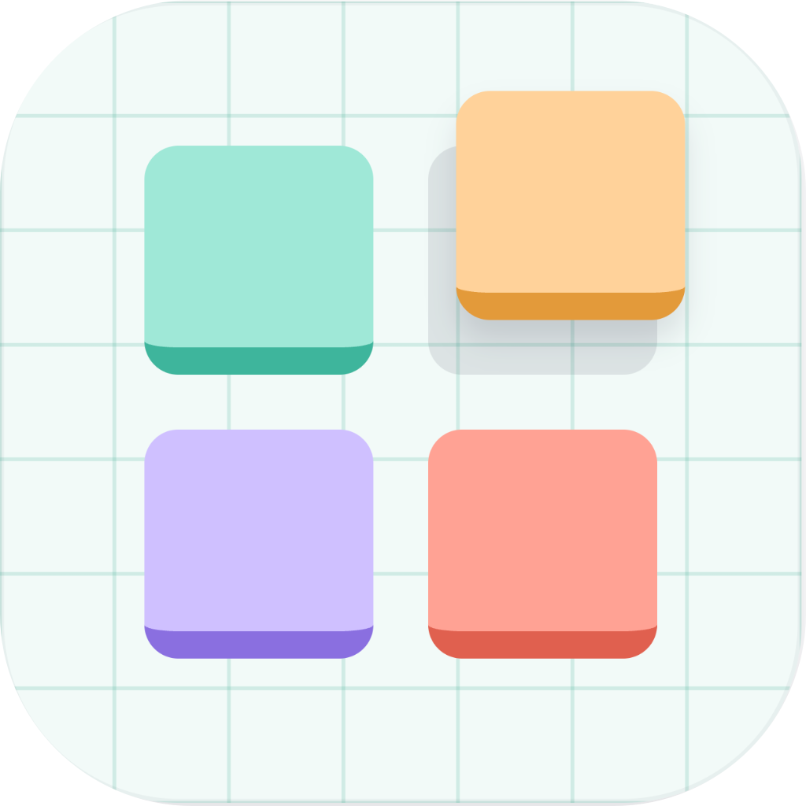

<p align="center"></p>

# OrlaBlocks

A 3D blockout editor for game levels, built to be co-edited by a human and an AI agent.

The human draws in a browser editor. The agent (Claude Code, or any MCP client) reads and edits the same scene through an MCP server. Both share one undo history. Beyond geometry, a scene carries **semantics**: descriptions, notes, tags, skills and a design guide. These tell the agent what the level is for, not just where things are.

## What's in it

- **Shapes**: boxes, cylinders, free-forms (bezier outlines), ramps and stairs, lines (annotations).
- **Kinds**: every closed shape is a *room* (hollow, with walls), a *volume* (solid, with optional taper, bevel and tilt) or a *hole* (cuts doors, windows and floor openings out of nearby shapes).
- **Groups** with descriptions. **Entities** (prefabs) with instances that follow their definition.
- **Notes**: post-its pinned in the scene, marked open or done. Open notes tell the agent what the human wants.
- **Library** (per project): `#tags` (properties), `@skills` (player abilities) and a markdown **design guide** (taste, game facts, house rules).
- **Projects → scenes**, saved to disk on every edit.

## Download

From the [latest release](../../releases/latest). No Node or other tools needed.

### macOS

Open the `.dmg` and drag **Orlablocks** to Applications. From 1.1 the app runs on Apple Silicon and Intel (1.0 is Apple Silicon only).

- **Not notarized yet**, so the first launch says Apple can't verify it. Click **Done**, then open **System Settings → Privacy & Security**, scroll down to *"Orlablocks" was blocked* and click **Open Anyway** (once; after that it opens normally). Or, in Terminal: `xattr -dr com.apple.quarantine /Applications/Orlablocks.app`.

### Windows (from 1.1)

- **`Orlablocks_<version>_x64_portable.exe`**: a single file, no install. Put it anywhere (Downloads, a USB stick) and double-click it. The first start unpacks its server to `%LOCALAPPDATA%\Orlablocks\runtime\`, so it takes a few seconds; later starts are instant.
- **`Orlablocks_<version>_x64-setup.exe`**: a normal installer, with a Start menu entry and an uninstaller.
- **Not signed yet**, so SmartScreen says "Windows protected your PC": click **More info**, then **Run anyway**.
- The window needs Microsoft **WebView2**, which Windows 11 has and Windows 10 gets with its updates. If it's missing, the portable `.exe` says so and links to Microsoft's download; the installer adds it.

### The Control Panel

The app opens the **Control Panel**: it runs the server in the background, picks your data folder (`~/Documents/Orlablocks` by default), opens the editor in your browser, and connects your agent (one click for Claude Desktop, a command to copy for Claude Code, a config snippet for Cursor, Windsurf and Antigravity). It also installs the **Orlablocks skill** ([`skills/orlablocks/SKILL.md`](skills/orlablocks/SKILL.md)), which teaches an agent how to design with it. Quitting the Control Panel stops the server.

## Run from source

Requires Node 22+.

```sh
npm install
npm run dev          # editor, WebSocket and MCP on http://127.0.0.1:5170
```

Open http://127.0.0.1:5170 and create a project.

Data is saved in `./data` (or set `DATA_DIR`). A lock file stops two servers from sharing one folder.

## Use with Claude Code

`.mcp.json` registers the `orlablocks` MCP server (`http://127.0.0.1:5170/mcp`).

1. Start the server first.
2. Run `claude` in the repo. If the server shows as failed, run `/mcp` to reconnect.
3. Ask for a layout. The agent reads the scene (`get_scene`, `find_nodes`, `get_guide design`) and edits it (`draw_shapes`, `update_nodes`, `move_nodes`, `mirror_nodes`, `make_entity`, ...). Changes appear in the editor live.

Selecting nodes in the editor tells the agent what "this" means.

## Editor keys

| Key | Tool | | Key | Action |
|---|---|---|---|---|
| `V` | Select | | `⌘Z` / `⇧⌘Z` | Undo / redo |
| `H` | Hand (or hold `Space`) | | `⌘G` / `⇧⌘G` | Group / ungroup |
| `B` | Box | | `⌘C` `⌘X` `⌘V` | Copy / cut / paste |
| `C` | Cylinder | | `⇧X` / `⇧Z` | Mirror on x / z |
| `P` | Pen (free-form) | | `I` | Isolate selection |
| `L` | Line | | `Delete` | Remove |
| `R` | Ramp / stairs | | `Esc` | Deselect / exit |
| `N` | Note | | | |

Units are meters. Y is up. North is −z.

## Develop

```sh
npm test             # unit tests
npm run typecheck
```

- `src/shared/`: types, schemas, geometry, meshes.
- `src/server/`: scene store, history, persistence, MCP and WebSocket.
- `src/web/`: React + three.js editor.
- `src/ui/`: the theme, fonts and wordmark shared by the editor and the Control Panel.
- `src/control-panel/` and `src-tauri/`: the desktop app (a Tauri 2 window).
- `plans/`: design docs, one per phase, kept as the project's development record. `GLOSSARY.md`: the terms used.

### Build the desktop app

Needs Rust (`rustup`) as well as Node.

```sh
npm run build        # dist/: the editor, the server bundle and the Control Panel
npm run package      # appbuilds/macos/: Orlablocks.app and the .dmg (bundles dist/ and this machine's Node)
```

Releases are built by GitHub Actions ([`.github/workflows/release.yml`](.github/workflows/release.yml)): the Universal Mac app and both Windows builds, each started and checked before it's kept. Run the workflow by hand for test builds, or push a tag `v<version>` (matching `package.json`) to attach them to a draft release.

## License

OrlaBlocks is free software under the [GNU Affero General Public License v3.0](LICENSE) (AGPL-3.0-only). Copyright © 2026 Orlando Almario.

- **Use it for anything**, including designing levels for commercial games. What you make with it (your projects, scenes and exports) is yours and isn't covered by the license.
- **If you distribute a modified OrlaBlocks, or run one as a service others use**, you must publish your changes under the AGPL too.
- **A commercial license** is available for anyone who wants to build on it without those terms (for example, in a closed product): write to yo@orla.games.

Contributions are welcome. By opening a pull request you agree that your contribution may be distributed under the AGPL and under OrlaBlocks' commercial licenses.
